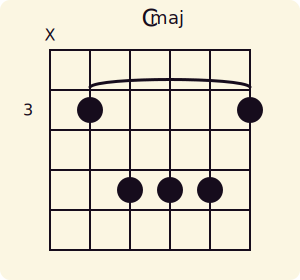
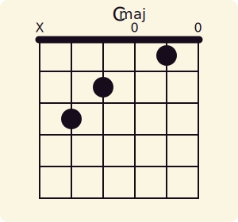

# Guitar Chord Diagrams

Rust library to create guitar chord diagrams in SVG format.

----

This fork of [`chord-gen`](https://github.com/whostolemyhat/chord-gen/tree/main) provides a simplified, embeddable API for rendering guitar chord diagrams as SVG files. It is designed for integration into my larger project.

> The original developers site can be found at [chordgenerator.xyz](https://chordgenerator.xyz)
> 
> **Note**: This fork removes the default footer.


----

### Structural Changes

- Removed `fingers` label system entirely.
- Removed hardcoded path derivative unit tests.
- Changed some internal rendering logic unrelated to SVG generation.
- Added muted string `"X"` markers and open string `"0"` markers.
- Retained the CLI interface in `main.rs` for reference (not active).

The codebase has been adapted to interface with a [chord shape library](assets/voicings.json) that defines chord shape templates relative to a barre position:

```python
# Define shape templates relative to the barre position (0 = barre)
voicings = {
    "Barre5": {
        "maj": [-1, 0, 2, 2, 2, 0],
        "min": [-1, 0, 2, 2, 1, 0],
        "7":   [-1, 0, 2, 0, 2, 0],
        "min7": [-1, 0, 2, 0, 1, 0],
        "maj7": [-1, 0, 2, 1, 2, 0],
        "sus2": [-1, 0, 2, 2, 0, 0]
    },
    "Barre6": {
        "maj": [0, 2, 2, 1, 0, 0],
        "min": [0, 2, 2, 0, 0, 0],
        "7":   [0, 2, 0, 1, 0, 0],
        "min7": [0, 2, 0, 0, 0, 0],
        "maj7": [0, 2, 1, 1, 0, 0]
    },
    "Open": {}
}
```

### Muted strings

Passing $-1$ to a string in `Chord.frets` indicates a string is muted. This is rendered via `src/svg/svg_draw_muted_string`

**Example**:

```rust
let shape = [-1, 0, 2, 2, 2, 0];
let fret = 3;
let frets: Vec<i32> = shape.iter()
    .map(|&f| {
        if f < 0 {
            -1 // preserve mute
        } else if f == 0 {
            fret // open string → fret 5
        } else {
            fret + f
        }
    })
    .collect();
let barre_fret = fret;

let chord = Chord {
    frets,
    title: Some(&"C".to_string()),
    suffix: Some(&"maj".to_string()),
    mode: Mode::Light,
    barres: Some(vec![barre_fret]),
    use_background: true,
    ..Default::default()
};

let svg = generate_svg(chord).unwrap();
```

**Produces**:



----

### Open Chords 

If `Chord.barre == None`, circles are drawn above open strings (those with 0 frets). This replaces the previous `fingers` attribute and is handled by `src/svg/svg_draw_open_string`.

**Example**:

```rust
let shape = [-1, 3, 2, 0, 1, 0]; // Standard C major open shape
let frets: Vec<i32> = shape.iter()
    .map(|&f| if f < 0 { -1 } else { f })
    .collect();

let chord = Chord {
    frets,
    title: Some(&"C".to_string()),
    suffix: Some(&"maj".to_string()),
    mode: Mode::Light,
    use_background: true,
    barres: None,
    ..Default::default()
};

let svg = generate_svg(chord).unwrap();
```

**Produces**



----

### Status

Two simple unit tests are defined in src/lib.rs:
- `generates_svg_for_barre3_major`: renders a Barre5 C major chord at the 3th fret and saves it as `fixtures/output/barre5_maj.svg`.
- `generates_svg_for_c_open`: renders a standard C open chord and saves it as `fixtures/output/cmaj_open.svg`.

These tests serve both as sanity checks and reproducible examples.

- A comprehensive "open" chord library is yet to be defined in [voicings.json](assets/voicings.json).
- Chromatic scale transposition logic will be handled in the parent project.

----

### Acknowledgements

This project is a fork of James Baum’s excellent [`chord-gen`](https://github.com/whostolemyhat/chord-gen/tree/main). Many thanks for the original implementation and thoughtful SVG rendering design.

**Built with 🦀 Rust and 🎸 music in mind.**

[](LICENSE.md) [](https://pineapple-bois.github.io)
